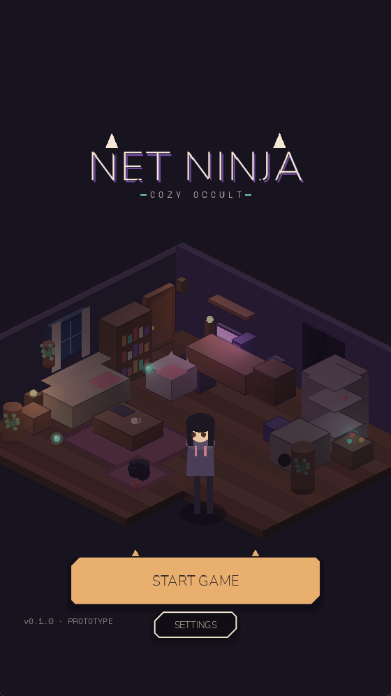
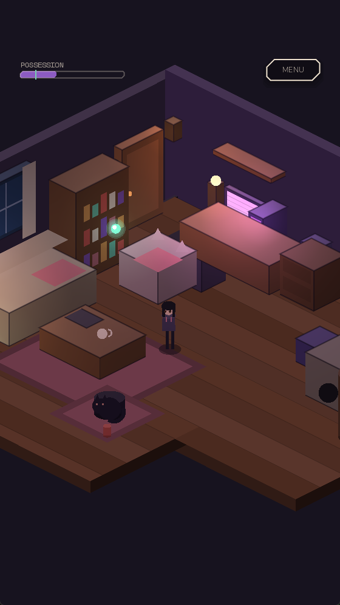

# Net Ninja — Godot prototype

> Cozy home. Cursed cats. Digital exorcism.

A Godot 4 prototype of the **main menu → room hub** slice of Net Ninja, built
directly against `docs/NetNinja_Visual_Foundation_v0.2.pdf`. Portrait mobile,
720 × 1280, isometric.

| Main menu | Room hub |
| --- | --- |
|  |  |

*Everything above is drawn procedurally — no sprites in the repo yet.*

## What is in the build

| | |
| --- | --- |
| **Main menu** | Live room behind the UI, zone layout straight from the visual foundation (logo 16–32%, Ami focal 32–78%, CTA 80–92%), one primary action, settings kept small and inside the safe area. |
| **Room hub** | Ami's flat as a walkable 2:1 isometric space: floorboards, wall dressing, the haunted desk PC, cat tree, Miso asleep on the rug, three drifting wisps, warm amber lamp pools against violet monitor bloom. |
| **Interaction** | Proximity prompts on the PC, Miso, the bookshelf, the tea and the front door. The PC raises possession; petting Miso lowers it, and the room visibly reacts. |
| **Input** | WASD / arrows / gamepad, plus an on-screen thumb stick for touch. `E` or tap to interact, `Esc` for the menu. |
| **Accessibility** | Reduce-motion and high-contrast toggles wired through `GameState`, plus a curse-level slider for eyeballing the possession states. |

## Running it

Requires **Godot 4.7** (no C#, no extra addons).

```bash
git clone https://github.com/lutherfourie/net-ninja-godot.git
cd net-ninja-godot
pwsh -File tools/fetch_fonts.ps1     # or ./tools/fetch_fonts.sh — optional, see assets/fonts/README.md
godot --path . 
```

The project runs without the fonts; it just falls back to Godot's default face.

## How it is put together

Three layers, and the boundary between them is the point of the whole exercise:

```
src/core/     world data and rules   — no rendering, no nodes with pixels
src/view/     renderers              — Room2DView today, Room3DView later
src/ui/       menus, HUD, components — one shape language, one token file
```

`PropDef` describes a chair as an origin, a size and a colour **in world units on
a 3D axis** (`+X` right, `+Y` up, `+Z` toward camera). `Room2DView` projects that
through `Iso` and paints it. A future `Room3DView` consumes the identical numbers
as meshes — the room author never touches `ami_apartment.gd` again. See
[docs/ARCHITECTURE.md](docs/ARCHITECTURE.md).

Design tokens (palette, type scale, corner cuts, safe margins, menu zones) live in
`src/autoload/palette.gd` and `src/autoload/tokens.gd`. Nothing in the UI hard-codes
a colour or a spacing value, so a design revision is a one-file change. See
[docs/STYLE_GUIDE.md](docs/STYLE_GUIDE.md).

## What this prototype deliberately is not

All room art is **procedural greybox** — shaded isometric solids in the brand
palette, drawn at runtime. There are no sprites in this repo yet. That is a
choice, not a gap: it keeps the layout honest while the real pixel and 3D
libraries are still being produced, and it means the room's silhouette can be
re-blocked in a text file in seconds.

Next up, in the order the visual foundation calls for it:
the net-catch gameplay loop (p.11–12), the email/contract panel (p.6),
the Cat-alog (p.10), and the real ruined display face (p.5).
See [docs/ROADMAP.md](docs/ROADMAP.md).

## Licence

Code is MIT — see [LICENSE](LICENSE). The Net Ninja name, art direction, visual
foundation document and character designs are not covered by it.
